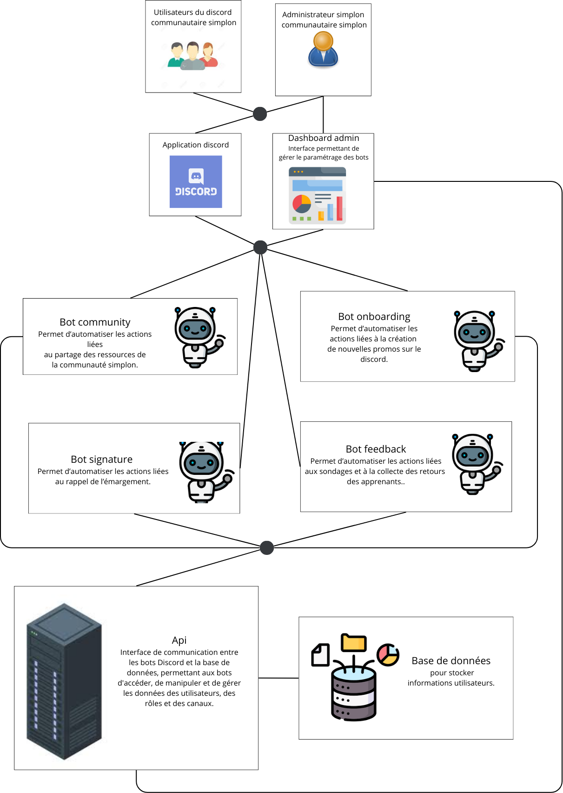

## Bot signature

Le système se décompose comme suit :

- Une base de données qui contient les informations des utilisateurs (identité,promotion, formation, etc...)
- Un dashboard pour automatiser des tâches récurrentes liées à la gestion des promotions :
    - Un bot onboardingboard qui permet de visualiser les information concernant les bots et modifieur leur configuration
- Les bots qui permettent d'au qui permet de créer des promotions et de les configurer
    - Un bot signature qui permet de rapidement prévenir les oublis d'émargement
    - Un bot feedback qui permet de collecter les retours des apprenants
    - Un bot community qui permet de gérer les partages de ressources

## Architecture du système

Ce document traite de la partie signature du système.