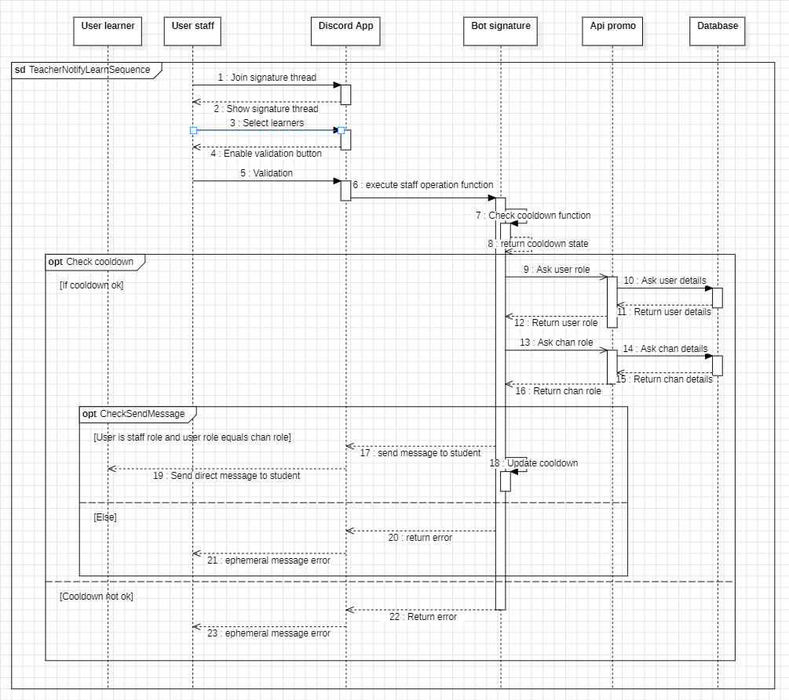
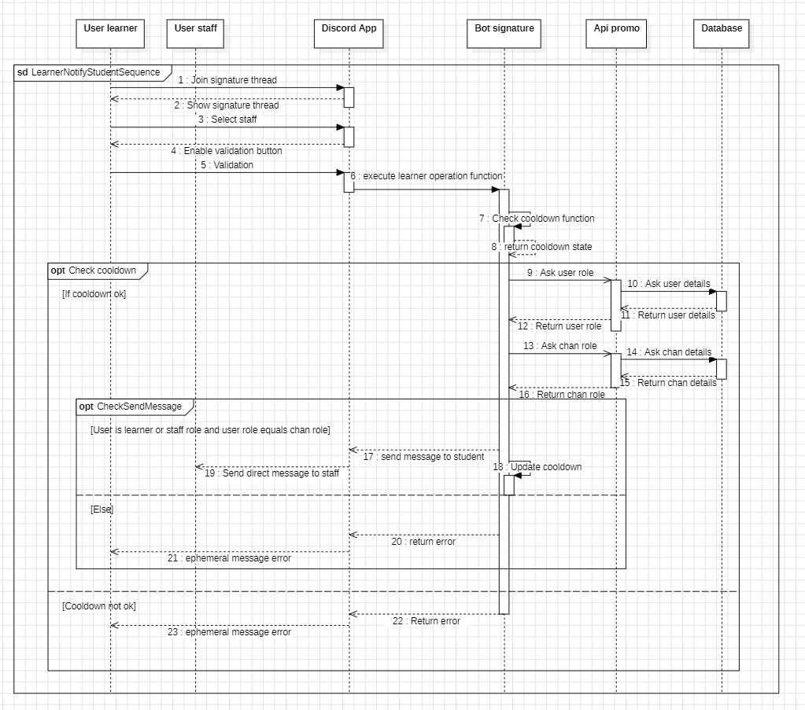

# Diagramme de séquence  
## Un formateur souhaite faire un rappel d'émargement pour une promotion.
Le formateur se rend dans le thread signature de discord de la promotion puis selectionne le ou les apprenants qu'il souhaite rappeler.
Le bot se charge d'envoyer un message privé à l'apprenant.

## Un apprenant souhaite signaler au formateur qu'il n'a pas autorisé l'émargement.
L'apprenant se rend dans le thread signature de discord de la promotion puis selectionne le membre du staff qu'il souhaite notifier.
Le bot se charge d'envoyer un message privé au formateur.

