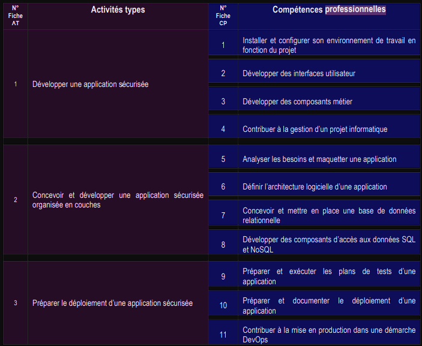

# Documentation du Projet

## Vue d'ensemble des compétences

## Sommaire

### [Présentation du Projet](./Presentation/presentation.md)

### [Spécifications Fonctionnelles](./Specifications_fonctionnelles/README.md)
- Documentation des Besoins
  - [Analyse des Besoins](./Specifications_fonctionnelles/Cahier_des_charges/analyse-des-besoins.md)
  - [Composition de l'Équipe](./Specifications_fonctionnelles/Cahier_des_charges/composition-equipe.md)
  - [Contexte et Enjeux](./Specifications_fonctionnelles/Cahier_des_charges/contexte-enjeux.md)
  - [Personas](./Specifications_fonctionnelles/Cahier_des_charges/personnas.md)
- Gestion du Projet
  - [Composition de l'Équipe](./Specifications_fonctionnelles/Gestion_du_projet/composition-equipe.md)
  - [Méthodologie de Travail](./Specifications_fonctionnelles/Gestion_du_projet/methodologie-travail.md)
- [Règles de Gestion](./Specifications_fonctionnelles/regles-gestion.md)

### [Spécifications Techniques](./Specifications_techniques/README.md)
- [Architecture N-tiers](./Specifications_techniques/architecture_N-tiers.md)
- [Questions Globales](./Specifications_techniques/questions-globales.md)
- Documentation API
  - [API REST](./Specifications_techniques/API/ApiRest.md)
  - [Cas d'Utilisation](./Specifications_techniques/API/cas-utilisation.md)
  - [Choix de la Stack API](./Specifications_techniques/API/choix-stack-api.md)
  - [Diagramme d'Activité](./Specifications_techniques/API/diagramme-activite.md)
  - [Diagramme de Classe](./Specifications_techniques/API/diagramme-classe.md)
  - [Diagramme de Séquence](./Specifications_techniques/API/diagramme-sequence.md)
  - [RBAC](./Specifications_techniques/API/rbac.md)
  - [Sécurisation API](./Specifications_techniques/API/securisation-api.md)
- Documentation Base de Données
  - [Choix de la Base de Données](./Specifications_techniques/Base_de_données/choix-bdd.md)
  - [Dictionnaire de Données](./Specifications_techniques/Base_de_données/dictionnaire-donnees.md)
  - [MCD](./Specifications_techniques/Base_de_données/mcd.md)
  - [MLD](./Specifications_techniques/Base_de_données/mld.md)
  - [MPD](./Specifications_techniques/Base_de_données/mpd.md)
  - [RGPD](./Specifications_techniques/Base_de_données/RGPD.md)
  - [Scripts BDD](./Specifications_techniques/Base_de_données/script-BDD.md)
  - [Sécurisation BDD](./Specifications_techniques/Base_de_données/securisation-bdd.md)
- Documentation Frontend
  - [Choix de la Stack Frontend](./Specifications_techniques/Front-end/choix-stack-front.md)
  - [Sécurisation Frontend](./Specifications_techniques/Front-end/securisation-front.md)

### [Résumé du Projet](./Resume_projet/resume_projet.md)

### [Veille Technologique](./Veille/Veille.md)

### [Outils](./Outils/outils.md)

# Introduction

- 1 [À propos de moi](#à-propos-de-moi)
- 2 [À propos du client](#à-propos-du-client)
- 3 [Le projet](#le-projet)

## Le projet.

Le système se décompose comme suit :

- Une base de données qui contient les informations des utilisateurs (identité,promotion, formation, etc...)
- Un dashboard pour automatiser des tâches récurrentes liées à la gestion des promotions :
    - Un bot onboardingboard qui permet de visualiser les information concernant les bots et modifieur leur configuration
- Les bots qui permettent d'au qui permet de créer des promotions et de les configurer
    - Un bot signature qui permet de rapidement prévenir les oublis d'émargement
    - Un bot feedback qui permet de collecter les retours des apprenants
    - Un bot community qui permet de gérer les partages de ressources

Ce document traite de la partie signature du système.

# Expression du besoin
La communication est la pierre angulaire du fonctionnement de toute organisation. Dans le cas de Simplon, s'assurer d'une communication fluide est crucial, aussi bien verticalement qu'horizontalement. La complexité de la circulation peut être résumée dans le schéma simplifié ci-dessous.

Il est à noter que si la distance physique entre les divers centres de formation et entre les centres et les alumni paraît évidente, une autre distanciation apparaît avec les formations ouvertes à distance, ce qui renforce encore le besoin d'un système de communication béton. 
Le plan à long terme est de former une communauté dans le but de créer du mentorat entre alumni et apprenants et de créer un canal de recrutement pour les entreprises. Cela mettra de surcroît l'accent sur la collaboration et le partage qui sont des principes clés dans le monde du développement (l'un des meilleurs exemples est le principe de l'open source qui colle parfaitement au mindset des valeurs susnommées). 
Le choix d'une plate-forme de communication s'avère compliqué car il faut tenir compte de plusieurs critères. Discord, malgré ses défauts que nous détaillerons plus bas, a été le meilleur compromis pour sa gratuité, son agnosticisme de plate-forme ainsi que sa popularité.
